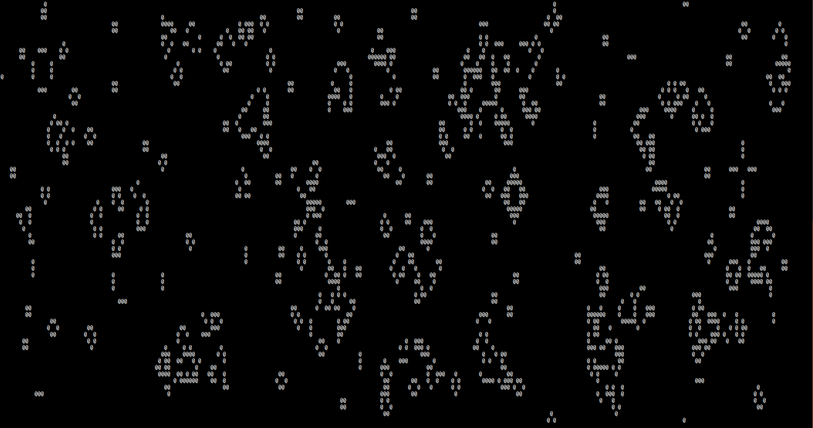

# CUDA_CA_sim

A cellular automaton simulation written in CUDA C++

# running the project

1. open a terminal in the project directory
2. \$ nvcc ca.cu
3. \$ ./a.out
4. You may have to zoom the terminal out so that the text output doesn't wrap to a new line: ctrl - should do the trick.

